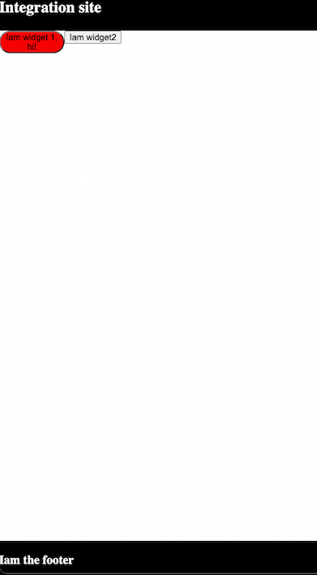

# Microfrontend using Vite + React + TypeScript

A proof of concept that demonstrates react integration to third party websites



 ## What this solves
The Strengths and Benefits of Micro Frontends. Micro-frontend architectures decompose a front-end app into individual, semi-independent “microapps” working loosely together. This can help make large projects more manageable.

## Use cases
- Your team wants to integrate a react app (like payment gateways, independent buttons, custom frontends) to a Website that is out of your scope
- SASS with a custom themes that align with where you integrate your widgets (Frontends)

## Notes
- The frontend is not necessarily needed to be in this repository, this can be served in a storage provider or any hosting services i.e `https://example.com/widget1.esm.js`

## Demo
Clone this repo

Install dependencies and build the frontends
```bash
  cd widget1 && yarn && yarn build && cd ../widget2/ && yarn &&  yarn build
```
Go to the root folder Serve the host site, in this example we use `PHP`
```bash
  php -S localhost:1234
```

Access your in browser http://localhost:1234/